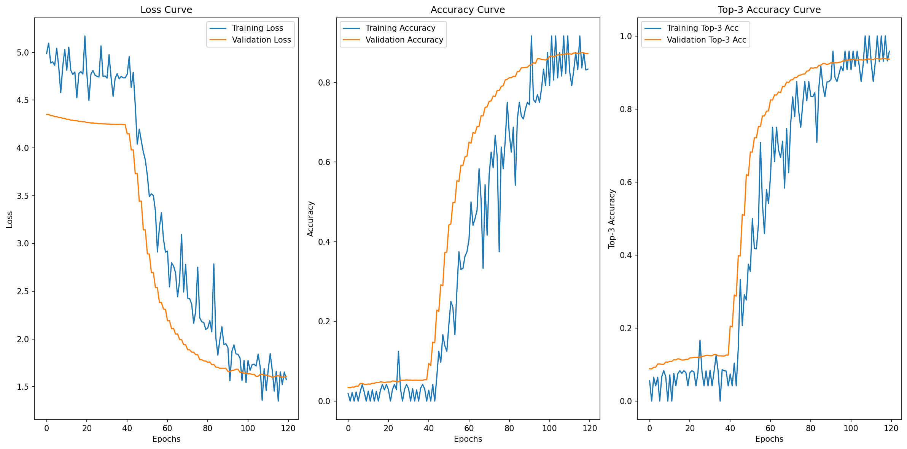

# **NBA球星图像识别系统 & 球星认识小游戏**

## 项目介绍

这个项目使用深度学习技术对NBA球星图像进行分类。项目基于TensorFlow实现，采用迁移学习策略，使用预训练的 EfficientNetV2L 模型作为基础架构，并添加了自定义的通道注意力机制。整个训练过程分为两个阶段：第一阶段冻结基础模型训练分类头，第二阶段解冻顶层进行微调优化；同时结合UI界面，将球星识别系统设计了一个球星识别小游戏，测试用户对NBA球星的了解程度

项目亮点：

- 实现**加权Top-3准确率**评估指标，更符合实际应用场景
- 采用**两阶段训练策略**提高模型性能
- 集成**通道注意力机制**增强特征提取能力
- 使用**余弦衰减+预热**的学习率调度策略
- **现代化UI设计**：采用渐变背景、动画按钮和流畅交互
- **资源优化**：支持相对路径访问，便于打包分发
- **跨平台兼容**：可在Windows、macOS和Linux系统运行


## 文件夹结构

```makefile
NBA/
├── assets/                  # 静态资源文件夹
├── data/                    # 球员图片数据集
    └── Allen_Iverson/       # 艾弗森图片（示例，共60位NBA球星）
        ├── 1.png            # 球员图片（命名格式为数字）
        └── ...              # 每个球员约300-400张图片
├── log/                     # 日志目录
├── output/                  # 输出目录
    ├── model/               # 训练好的模型
    └── pic/                 # 生成的图片
├── README.md
├── build.spec               # PyInstaller打包配置
├── class.txt                # 分类标签
├── data.ipynb
├── demo.py                  # 主程序（带GUI的识别系统）
├── demo.mp4                 # 演示视频
├── predict.py               # 预测脚本
├── requirements.txt
└── train.py                 # 训练脚本
```


## 数据集说明

数据集为项目贡献者（rexinshiminxiaozhou）使用插件在图片版权网站上爬取，并进行清洗和整理得到，如果您在您的工作中使用到了本项目的数据集，请参照如下方式进行引用：

```makefile
@misc{YourLastName_NBA_Player_Dataset,
  author       = {xiaozhou},
  title        = {{NBA球星照片数据集 (NBA_Player)}},
  year         = {2025},
  howpublished = {\url{数据集永久链接 (如 DOI)}},
  note         = {访问日期: 访问日期},
  license      = {CC BY 4.0}
}
```

==ps：全网**最大最全**的开源NBA巨星图片数据库，仅供学习使用，请勿商用！！！==

数据集包含多位NBA球星的图像，结构如下：

```makefile
data/
├── Allen_Iverson/
│   ├── 1.jpg
│   └── ...
├── Andre_Iguodala/
│   ├── 1.jpg
│   └── ...
└── ...
```

数据集球星类别和数量统计如下所示：


数据集特点：

- 每个子目录对应一个球员类别
- 自动划分训练集/验证集（80%/20%）
- 项目中使用多种**数据增强技术**处理图像：
  - 随机旋转（±30度）
  - 宽度/高度偏移（±30%）
  - 剪切变换（±30%）
  - 缩放（70%-130%）
  - 水平/垂直翻转
  - 亮度调整（70%-130%）
  - 通道偏移


## 模型架构实现

### 基础模型

使用**EfficientNetV2L**作为基础架构：

- ImageNet预训练权重
- 输入尺寸：300×300×3
- 不包括顶层分类器
- 第一阶段训练时冻结所有权重

### 通道注意力机制

### 分类头

在基础模型后添加多层分类头：

1. 通道注意力层（压缩比8:1）
2. 全局平均池化层
3. BatchNormalization + Dropout(0.5)
4. 全连接层(2048单元) + BN + ReLU + Dropout(0.5)
5. 全连接层(1024单元) + BN + ReLU + Dropout(0.4)
6. 输出层（softmax激活）

### 训练策略

**两阶段训练流程：**

1. **第一阶段**（冻结基础模型）：
   - 仅训练分类头
   - 初始学习率：1e-4
   - 使用余弦衰减+线性预热学习率调度
   - 标签平滑正则化（0.1）
   - 提前停止机制（耐心值15）
2. **第二阶段**（微调顶层）：
   - 解冻最后30%的层
   - 降低学习率至1e-5
   - 继续训练直至收敛
   - 使用ReduceLROnPlateau回调自动调整学习率

### 评估指标

1. 标准Top-1准确率
2. 标准Top-3准确率
3. **加权Top-3准确率**：
   - 第一名正确：1.0分
   - 第二名正确：0.8分
   - 第三名正确：0.6分
   - 未出现在前三：0分

## 快速开始

### 安装依赖

```bash
pip install -r requirements.txt
```

### 开始训练

```bash
python train.py
```

### 识别系统和认识球星小游戏 UI界面

```bash
python demo.py
```

### (可选)生成可执行exe文件

```bash
pyinstaller build.spec
```


## 结果展示

### 训练曲线



### 评估结果

```makefile
Weighted Top-3 Accuracy: 0.9211
Top-1 Accuracy: 0.8734
Top-3 Accuracy: 0.9377
```

### 验证集样例测试输出


### 样例预测输出

```makefile
Sample 1:
  Image: 63.png
  True: David_Robinson
  Top-3 Predictions:
    1. David_Robinson: 0.7951
    2. Michael_Jordan: 0.0591
    3. Hakeem_Olajuwon: 0.0580
Sample 2:
  Image: 79.png
  True: Reggie_Miller
  Top-3 Predictions:
    1. Reggie_Miller: 0.9810
    2. Ray_Allen: 0.0175
    3. Charles_Barkley: 0.0002
```

### UI界面使用视频(demo.mp4)如下：

<video src="./demo.mp4"></video>
